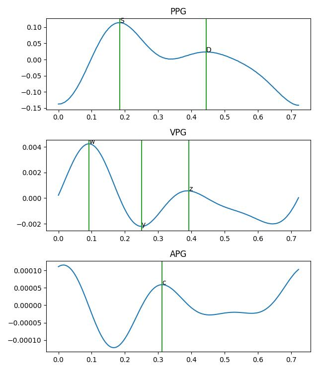

# RC PPG tools and prediction of blood pressure (ONGOING WORK)
This is a little project to re-familiarize myself with PPG signal by building a few tools.
The aim is to be able to clean and extract features from PPG signal, and ideally predict blood pressure. 
The Dataset used is the pulse-transit-time (Mehrgardt et al. 2022). It is good for my purpose, but it is lacking an
instantaneous measure of blood pressure which makes prediction tricky.

(This is still far from perfect and can still be improved)

## Cleaning
For now, I stick to classics and according to (liang et al., 2018), a 4th order cheby2 filter works well. The selection
of good period is then done in the feature extraction.

## lag between proximal and distal finger ppg
To extract the lag, I'm using cross-correlation on epochs of 5 seconds and keep only the ones in which there is a
positive peak indicating a lag of less than 50 ms between the two signals.

## Peak features
I extract features from PPG and its derivatives according to (Liang et al., 2018). I detect the valley in the ppg signal
and separate in peaks from foot to foot. Then I look for the classic points of interest in PPG, VPG and APG. Only 
the peaks in which the points can be found are considered

## Frequency features
This could probably be done better. At the moment, I use welch method to extract psd and grab maximums in specific Hz 
range to find the 3 peaks. A better approach would be to assess quality of each epoch before averaging.

## Classification
Not working well for now.
I take all the features, reduce their number by removing collinear groups and train an ADA boost. There's only 22 
subjects so I use leave-one-out cross-validation. The result is not good, likely due to low number of subject and just
one value of blood pressure per subject. I expect a within subject variability prediction would work better.

## Next steps
- Improve cleaning
- investigate with moving baseline removal
- ICA between channels?
- Convolution with model or template peak
- Improve feature detection (get the remaining in the APG)
- use composite features based on literature
- More statistics on the features
- Finally try in the walk and run files to challenge the whole thing
- Bigger dataset

## Data
- https://physionet.org/content/pulse-transit-time-ppg/1.1.0/#files-panel

## Bibliography

- https://pubmed.ncbi.nlm.nih.gov/31388564/
- https://pmc.ncbi.nlm.nih.gov/articles/PMC6163274/
- https://pmc.ncbi.nlm.nih.gov/articles/PMC7309072/
- https://www.nature.com/articles/sdata201876
