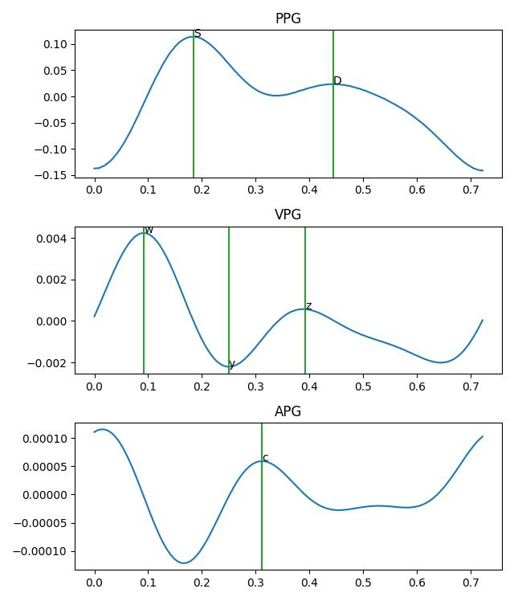
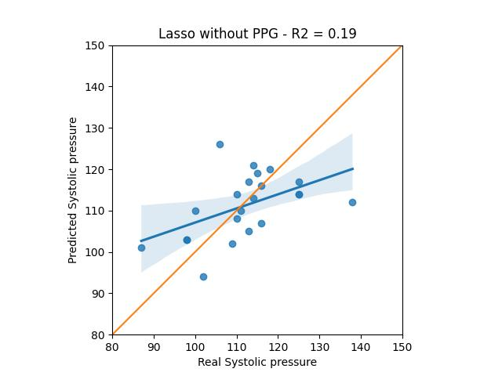
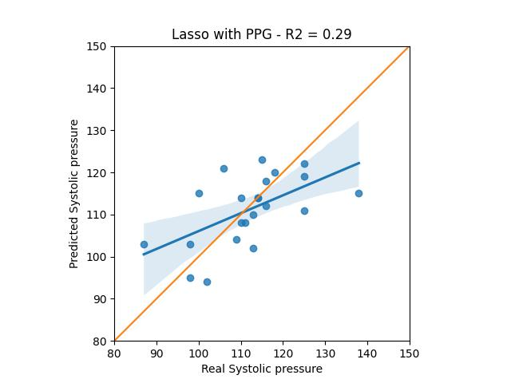

# RC PPG tools and prediction of blood pressure (ONGOING WORK)
This is a little project to re-familiarize myself with PPG signal by building a few tools.
The aim is to be able to clean and extract features from PPG signal, and ideally predict blood pressure. 
The Dataset used is the pulse-transit-time (Mehrgardt et al. 2022). It is good for my purpose, but it is lacking an
instantaneous measure of blood pressure which makes prediction tricky.

(This is still far from perfect and can still be improved)

## Cleaning
For now, I stick to classics and according to (liang et al., 2018), a 4th order cheby2 filter works well. The selection
of good period is then done in the feature extraction.

## lag between proximal and distal finger ppg
To extract the lag, I'm using cross-correlation on epochs of 5 seconds and keep only the ones in which there is a
positive peak indicating a lag of less than 50 ms between the two signals.

## Peak features
I extract features from PPG and its derivatives according to (Liang et al., 2018). I detect the valley in the ppg signal
and separate in peaks from foot to foot. Then I look for the classic points of interest in PPG, VPG and APG. Only 
the peaks in which the points can be found are considered. I then use an Isolation forest to further remove outlier
peaks based on their features.



## Frequency features
This could probably be done better. At the moment, I use welch method to extract psd and grab maximums in specific Hz 
range to find the 3 peaks. A better approach would be to assess quality of each epoch before averaging.

## Regression
Kind of working, however there are some caveas. I create a composite features with PCAs, one for demography and another
from PPG features (both temporal and frequency). This is potentially an issue, as it means the PCA are fitted using the 
test data as well. With so few data points it's not realistic otherwise.
There's only 22 subjects so I use leave-one-out cross-validation and check the R2 on the test values obtained from each
trained model. The interesting point is that it seems adding the PPG feature indeed seems to increase accuracy as in
(Sola et al. 2025). The lag between the two PPG is surprisingly not a very good features. I might have to investigate
more.




## Next steps
- Improve cleaning (best filter to clean, but keep BP related features?)
- investigate with moving baseline removal
- Convolution with model or template peak to find them more efficiently
- Improve feature detection (get the remaining in the APG)
- use different composite features based on literature
- Finally try in the walk and run files to challenge the whole thing
- Bigger dataset

## Data
- https://physionet.org/content/pulse-transit-time-ppg/1.1.0/#files-panel

## Bibliography

- https://pubmed.ncbi.nlm.nih.gov/31388564/
- https://pmc.ncbi.nlm.nih.gov/articles/PMC6163274/
- https://pmc.ncbi.nlm.nih.gov/articles/PMC7309072/
- https://www.nature.com/articles/sdata201876
- https://www.frontiersin.org/journals/digital-health/articles/10.3389/fdgth.2025.1518322/full

## result of a simple linear regression on the whole dataset
```
                            OLS Regression Results                            
==============================================================================
Dep. Variable:                      y   R-squared:                       0.633
Model:                            OLS   Adj. R-squared:                  0.547
Method:                 Least Squares   F-statistic:                     7.331
Date:                Tue, 27 May 2025   Prob (F-statistic):            0.00127
Time:                        17:42:46   Log-Likelihood:                -72.620
No. Observations:                  22   AIC:                             155.2
Df Residuals:                      17   BIC:                             160.7
Df Model:                           4                                         
Covariance Type:            nonrobust                                         
==============================================================================
                 coef    std err          t      P>|t|      [0.025      0.975]
------------------------------------------------------------------------------
const        136.0020     13.546     10.040      0.000     107.423     164.581
DEM            0.4397      0.114      3.841      0.001       0.198       0.681
pleth_lag     -0.1984      0.133     -1.490      0.154      -0.479       0.082
bpm           -0.4096      0.285     -1.437      0.169      -1.011       0.192
PPG            0.3456      0.188      1.837      0.084      -0.051       0.743
==============================================================================
Omnibus:                        0.506   Durbin-Watson:                   1.416
Prob(Omnibus):                  0.777   Jarque-Bera (JB):                0.454
Skew:                          -0.305   Prob(JB):                        0.797
Kurtosis:                       2.651   Cond. No.                         456.
==============================================================================
Notes:
[1] Standard Errors assume that the covariance matrix of the errors is correctly specified.
```