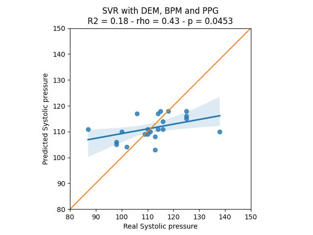
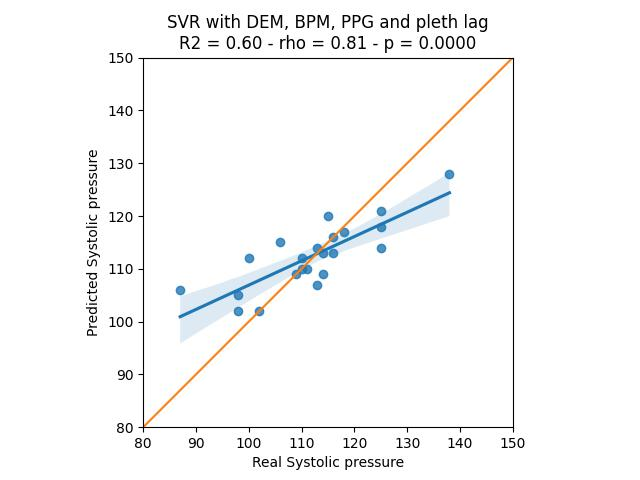

# RC PPG tools and prediction of blood pressure (ONGOING WORK)
This is a little project to re-familiarize myself with PPG signal by building a few tools.
The aim is to be able to clean and extract features from PPG signal, and ideally predict blood pressure. 
The Dataset used is the pulse-transit-time (Mehrgardt et al. 2022). It is good for my purpose, but it contains only 22
subjects which limits the power.

(This can still be improved)

## Cleaning
For now, I stick to classics and according to (liang et al., 2018), a 4th order cheby2 filter works well. The selection
of good period is then done in the feature extraction.

## lag between proximal and distal finger ppg
To extract the lag, I lowpass filter more the data to isolate systolic peaks, then I'm using cross-correlation on epochs
of 4 seconds with 3 second overlap and keep only the ones in which there is a positive peak indicating a lag of less
than 100 ms between the two signals.

## Peak features
I extract features from PPG and its derivatives according to (Liang et al., 2018). I detect the valley in the ppg signal
and separate in peaks from foot to foot. Then I look for the classic points of interest in PPG, VPG and APG. Only 
the peaks in which the points can be found are considered. I then use an Isolation forest to further remove outlier
peaks based on their features.


## Frequency features
This could probably be done better. At the moment, I use welch method to extract psd and grab maximums in specific Hz 
range to find the 3 peaks. A better approach would be to assess quality of each epoch before averaging.

## Regression
Kind of working, however there are some caveas. I create a composite features with PCAs, one for demography and another
from PPG features (both temporal and frequency). This is potentially an issue, as it means the PCA are fitted using the 
test data as well. With so few data points it's not realistic otherwise.
There's only 22 subjects so I use leave-one-out cross-validation and a SVR with linear kernel. I check the R2 and
pearson Rho on the test values obtained from each trained model. Adding PPG improves accuracy as in (Sola et al. 2025),
only when the lag between the two PPG is also present.





## Next steps
- Improve cleaning (best filter to clean, but keep BP related features?)
- investigate with moving baseline removal
- Convolution with model or template peak to find them more efficiently
- Improve peak feature detection
- Improve frequency feature detection
- use different composite features based on literature
- Finally try in the walk and run files to challenge the whole thing
- Bigger dataset

## Data
- https://physionet.org/content/pulse-transit-time-ppg/1.1.0/#files-panel

## Bibliography

- https://pubmed.ncbi.nlm.nih.gov/31388564/
- https://pmc.ncbi.nlm.nih.gov/articles/PMC6163274/
- https://pmc.ncbi.nlm.nih.gov/articles/PMC7309072/
- https://www.nature.com/articles/sdata201876
- https://www.frontiersin.org/journals/digital-health/articles/10.3389/fdgth.2025.1518322/full

## result of a simple linear regression on the whole dataset
```
                            OLS Regression Results                            
==============================================================================
Dep. Variable:                      y   R-squared:                       0.737
Model:                            OLS   Adj. R-squared:                  0.655
Method:                 Least Squares   F-statistic:                     8.959
Date:                Thu, 12 Jun 2025   Prob (F-statistic):           0.000326
Time:                        10:11:13   Log-Likelihood:                -68.963
No. Observations:                  22   AIC:                             149.9
Df Residuals:                      16   BIC:                             156.5
Df Model:                           5                                         
Covariance Type:            nonrobust                                         
==============================================================================
                 coef    std err          t      P>|t|      [0.025      0.975]
------------------------------------------------------------------------------
const        151.1176     13.816     10.938      0.000     121.828     180.407
DEM            0.4198      0.100      4.205      0.001       0.208       0.631
pleth_lag     -0.1144      0.063     -1.825      0.087      -0.247       0.019
bpm           -0.7467      0.292     -2.554      0.021      -1.367      -0.127
PPG1           0.2847      0.100      2.834      0.012       0.072       0.498
PPG2           0.3105      0.151      2.059      0.056      -0.009       0.630
==============================================================================
Omnibus:                        1.826   Durbin-Watson:                   1.448
Prob(Omnibus):                  0.401   Jarque-Bera (JB):                0.726
Skew:                          -0.409   Prob(JB):                        0.696
Kurtosis:                       3.350   Cond. No.                         583.
==============================================================================
Notes:
[1] Standard Errors assume that the covariance matrix of the errors is correctly specified.
```